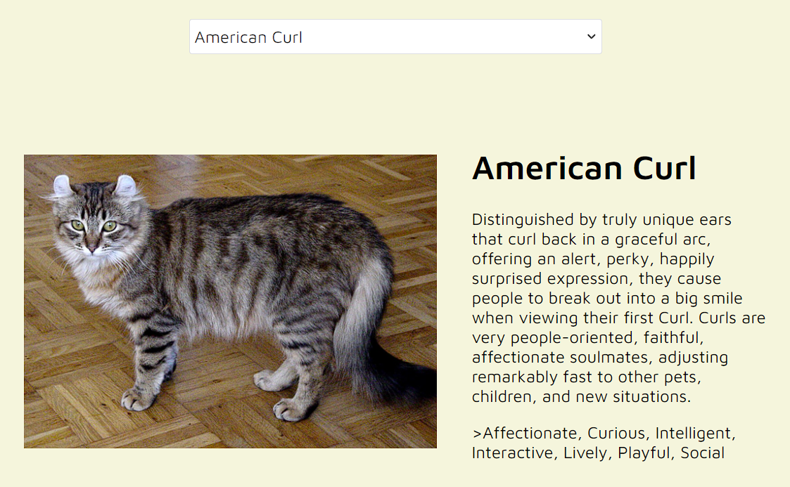
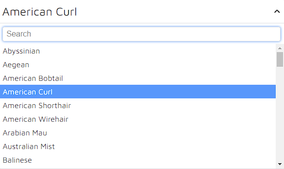

# Cat Search Website - project

- This is a simple, interactive website created using HTML, CSS, and JavaScript,
  enhanced with additional libraries such as Axios, Notiflix, and Slim-Select

## Table of Contents

- [General Info](#general-information)
- [Technologies Used](#technologies-used)
- [Project Features](#project-features)
- [Project Objectives](#project-objectives)

## General Information

- This project is a simple website created to expand knowledge and gain
  experience in web development.

## Technologies Used:

- HTML: Responsible for the structure of the web page.
- CSS: Cascading Style Sheets, providing aesthetics and layout for the page.
- JavaScript: Used for interactive search functionality, fetching data from an
  API (via Axios), and handling dropdown lists (Slim-Select).
- Axios: Facilitates seamless communication with an external API through
  asynchronous HTTP requests.
- Notiflix: Utilized for elegant notification displays on the page.
- Slim-Select: Offers stylish and user-friendly dropdown lists.

## Project Features:

- Dynamic Results Display:
  - Upon choosing a search phrase, the page dynamically presents users with
    results, including images and brief descriptions of cat breeds.
    
- Notifications:
  - Notiflix is used for gracefully displaying notifications, informing users
    about search results.
- Dropdown Lists:
  - Slim-Select enables users to make convenient selections from dropdown lists.
    
- Loader:
  - Loader informs users about what's going on in the background

## Project Objectives:

- Expand knowledge in creating responsive and interactive web pages.
- Learn to integrate external libraries, such as Axios, Notiflix, and
  Slim-Select.
- Gain practical experience in using APIs to retrieve data.
- Utilize JavaScript promises for asynchronous handling of HTTP requests and
  data management.
- Use Notiflix and Slim-Select to improve the user experience while navigating
  the site.

## Setup

To run this project, install it locally using npm:

```
npm i
npm start
```
