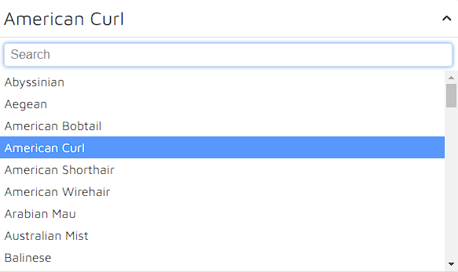
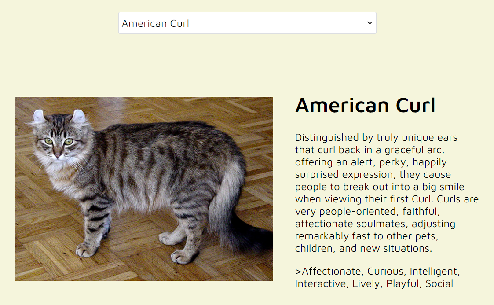

# Cat Search App

An interactive web application built with  JavaScript for searching cat breeds and viewing images fetched from an external API.

## Technologies Used
* HTML
* CSS
* JavaScript
* Axios
* Slim-Select (custom select component)
* Notiflix (UI notifications)

## Key Features
* **Dynamic Data Fetching:** Utilized Axios and JavaScript Promises to asynchronously retrieve breed information and images from a REST API.
* **Custom Dropdown:** Integrated Slim-Select for an enhanced select element experience.
   
* **Detailed View:** Dynamic DOM manipulation to render breed details, descriptions, and corresponding images.
   
* **State & Error Handling:** Loader indicator during asynchronous API queries and Notiflix toast alerts for error management.

## Setup

To run this project, install it locally using npm:

```
npm i
npm start
```
